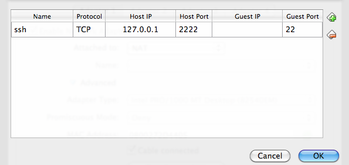

Virtualbox
==========

Virtualbox is a virtualizacion software, it's opensource and is avaible under a GPLv2. You can download it for free at https://www.virtualbox.org/wiki/Downloads

Obtain images
-------------

You can manualy install lot of OS. But if you want to start very fast VirtualBoxImages_ offers ready to launch images, some are free others not.

Free VDI's are avaible at http://virtualboximages.com/Free.VirtualBox.VDI.Downloads.

.. _VirtualBoxImages: http://virtualboximages.com/

Tunning
-------

SSH
....

To connect to guest using ssh, it's needed to configure the port redirecton at the 
virtualbox image. You can do using the commandline or the gui.

Using the commandline (when the image is stopped)::

	VBoxManage modifyvm "VM name" --natpf1 "ssh,tcp,,2222,,22"

Using the gui::

	Machine > Settings > Network > Port forwarding > Insert new Rule (+)

	And fill the table with (4th column is empty, see pecture):

	ssh | tcp | 127.0.0.1 |       | 22

	SSH forwarding

	
API
----

Virtualbox has an `API` or `SDK` for developers, see *SDK Programmin Guide* at  https://www.virtualbox.org/wiki/Technical_documentation

The API can't be used with Python, Java, C++, C or Visualbasic. The following example shows how to retrive the name of the existing machines::

	import vboxapi
	 man = vboxapi.VirtualBoxManager(None, None)
	[i.name for i in man.getArray(man.vbox, "machines")]

