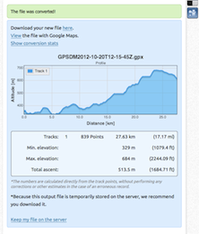

========================
GPS - Tracker's and more
========================
:Subject: GPS tracking systems and utilities
:Modified: |modified|
:Date created: 2012-10-24
:Version: 1.0

.. |modified| date:: %Y-%m-%d %H:%M

.. contents::

Tracking
--------

GPS Data Master (Blackberry)
............................

GPS Data Master is a tracking application for Blackberry devices, it's avaible free of charge at the `Blackberry AppStore`_.

One enabled the loggin option, every time the app is closed a file inside the documents folder is stored.
The track will be stored in `GPX format`_, this format need to be convert to kml if we want to see it in Google Maps, see `gpx to kml`_.

.. _`blackberry appstore`: https://appworld.blackberry.com/webstore/content/104986/?lang=EN

Visualization
-------------

Google maps
...........

With Google Maps we can visualize kml files from any url or import a file to My Maps. If we want to visualize one of our files we only need to upload it to Dropbox or Google Drive and use the public link option.

The url of the kml file must be inserted in the Google Maps search box, or appended to the uri::

	https://maps.google.com/maps?q=

More info at http://gis.stackexchange.com/questions/235/display-a-local-file-in-google-maps

Utilities
---------

gpx to kml
..........

This process can be done online at http://gpx2kml.com/, it offers usseful options like stats or view in Google Maps.

.. _GPX format: http://www.topografix.com/GPX/1/1/

:tags: kml, gpx, google maps, gps
